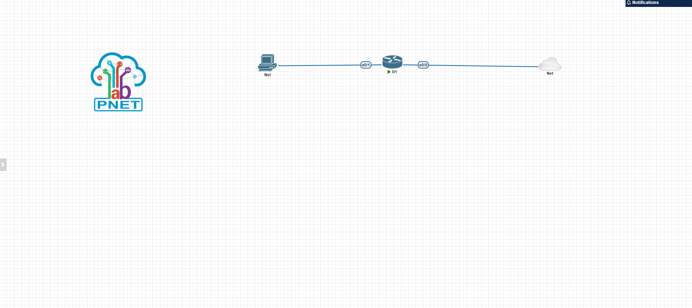
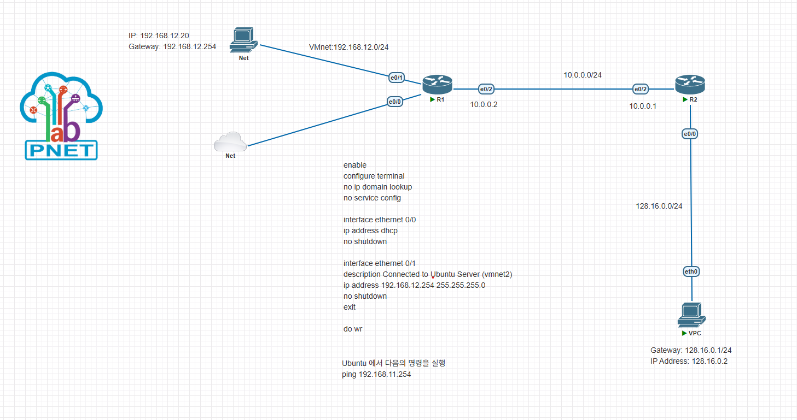

# 04. 외부 네트워크 연결
2025-08-05 (TUE)

## PNET 토폴로지

### 라우터 1
ethernet: 1

### 네트워크 1
type: management (Cloud0)

### 네트워크 2
type: cloud 1 
선택시 vmnet1번/virtual interface와 연결됨?

## 터미널 설정
```bash
# 라우터 R1 설정
enable
configure terminal
hostname R1
# 에러 메세지 해결
no ip domain-lookup
no service config  
no cts logging verbose
no ntp server
#
interface ethernet 0/0
ip address dhcp
no shutdown
# 저장
wr

# 네트워크 연결 상태 확인할 때 자주 사용하는 방법 (Google DNS Server)
ping 8.8.8.8
```
## Ubuntu Server 활성화 (옛날 방식)
Open SSH 및 유저 설정만 변경

## Vagrant 로 Ubuntu 설치

Vagrant (web) > Install > Windows (amd64)

```bash
# vagrant 설치 후 powershell 에서 버전 체크
powershell> vagrant --version
```

Vagrant Hashicorp Cloud Platform (web) > Go back > providers -> vmware, wmware_desktop, wmware_fusion, wmware_workstation   

```bash
"""STEP1: terminal"""
# Create a Vagrantfile and initiate the box
> vagrant init bento/ubuntu-22.04 --box-version 202508.03.0

"""STEP2: Vagrantfile 설정"""
Vagrant.configure("2") do |config|
 
  config.vm.box = "bento/ubuntu-22.04"
  config.vm.box_version = "202508.03.0"

  config.vm.provider "vmware_desktop" do |vm|
  vm.memory = 2048
  vm.cpus = 2
  end
end

"""STEP3: terminal"""
# plugin 설치 (미설치시)
> vagrant plugin install vagrant-vmware-desktop
> vagrant plugin list

# Bring up your virtual machine
> vagrant up

"""STEP4: Vagrantfile"""
# vmnet 1
config.vm.network "private_network", ip: "192.168.12.20"

"""STEP5: pnet R1"""
enable
configure terminal
no ip domain lookup
no service config

interface ethernet 0/0
ip address dhcp 
no shutdown

interface ethernet 0/1
description Connected to Ubuntu Server (vmnet1)
ip address 192.168.12.254 255.255.255.0
no shutdown
exit

do wr

"""STEP6: VMware"""
pnet & ubuntu setting > add Network Adapter > custom to VMnet#
```

```bash
"""terminal"""
# 다 지우기
> vagrant destroy  

# 어디서 동작하고 있는지 볼 수 있음
> vagrant global-status 

# 특정 id 정리할 때
> vagrant destroy id

# sample dir 안 머신 shell 접속
> vagrant ssh

# vagrant up 이후 Vagrantfile 변경
> vagrant reload # 메모리, CPU, 포트포워딩, 공유 폴더
> vagrant provision # shell script, ansible, puppet
```


| 용어 | 설명 | 예시 |
|------|------|------|
|**Vagrant Box**| 가상 머신의 미리 준비된 템플릿 이미지 (운영체제 직접 설치 필요 x, 명령 한 번으로 가상 머신 만들기 O)
| **Vagrant** | 가상 머신을 코드로 관리해주는 도구 (명령줄 기반) |
| **Box** | OS 이미지 + 설정이 포함된 VM 템플릿 파일 | Ubuntu image, Windows server |
| **Provider** | 실제 가상 머신을 실행하는 플랫폼 | VirtualBox, Vmware |
| **Vagrantfile** | VM 설정을 정의하는 파일 |  

------
  
Vmware 네트워크
  NAT (가장 많이 사용함):  
    가상 호스트 > 인터넷 O  
    가상 호스트 < 인터넷 X (포트 포워딩을 하면 가능)

  HostOnly  
    가상 호스트 <> 가상 호스트 (only)    
    격리된 네트워크 (private network)
  Bridge  
    가상 호스트가 실제 IP 주소를 할당 받아 사용
  
  Network Adapter (가상 머신의 NIC)
    ...2
    ...3
    ...4
    끝에 붙으면 그 수를 추가하는 것

  VMnet (가상의 네트워크)
    ex. VMnet1, VMnet2, ...VMnetN
    VMnet1 <> HostOnly
    VMnet8 & VMnet0 (특수 용도로 사용)
    VMnet8 <> NAT (NA 무조선 8에 붙어 있음)
    VMnet0 <> Bridge

  NA2 번부터 VMnet1이라던지 2에 붙을 수 있음

  방화벽 (win+R > wf.msc) > ICMP 규칙 활성화 > 속성 > 영역 > 원격 주소 > 모든 IP 허용

  # Task 1
  기존 토폴로지에 Router 및 VPC 추가해서 ping 확인하기
  

  ## Static Routing
  ```bash
  # VPC 
  > set pcname VPC1
  > ip 128.16.0.2 128.16.0.1 # <ip_add gate_way>

  # R1
  > inter eth 0/1
  > ip add 192.168.12.254 255.255.254.0
  > exit
  > wr

  > show running-config
  > ip route 192.168.16.0.0 255.255.255.0 eth 0/2 10.0.0.1

  # R2
  > inter eth 0/0
  > ip add 128.16.0.1 255.255.255.0
  > exit
  > wr

  > inter eth 0/2
  > ip add 10.0.0.1 255.255.255.0
  > exit
  > wr

  > ip route 192.168.12.0 255.255.255.0 eth 0/2 10.0.0.2

  # 우분투 NAT 인터페이스 비활성화
  > ip route show
  > sudo ip route add default via 192.168.12.254 dev eth1 metric 10
  > # R1 에서 DHCP로 받은 주소 

  # VPC1
  > ping 192.168.12.20

  # Vagrant Ubuntu
  > ping 128.16.0.2
  ```


