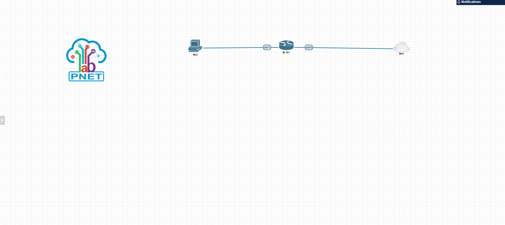
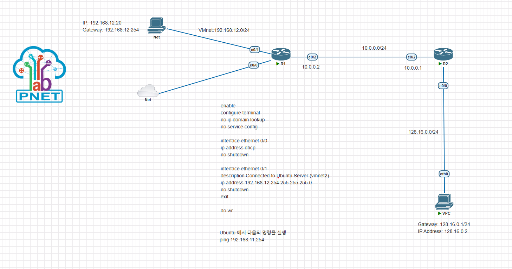

# 04. 외부 네트워크 연결
2025-08-05 (TUE)

## PNET 토폴로지

### 라우터 1
ethernet: 1

### 네트워크 1
type: management (Cloud0)

### 네트워크 2
type: cloud 1 
선택시 vmnet1번/virtual interface와 연결됨?

## 터미널 설정
```bash
# 라우터 R1 설정
enable
configure terminal
hostname R1
# 에러 메세지 해결
no ip domain lookup
no service config  
no cts logging verbose
no ntp server
#
interface ethernet 0/0
ip address dhcp
no shutdown
# 저장
wr

# 네트워크 연결 상태 확인할 때 자주 사용하는 방법 (Google DNS Server)
ping 8.8.8.8
```
## Ubuntu Server 활성화 (옛날 방식)
Open SSH 및 유저 설정만 변경

## Vagrant 로 Ubuntu 설치

Vagrant (web) > Install > Windows (amd64)

```bash
# vagrant 설치 후 powershell 에서 버전 체크
powershell> vagrant --version
```

Vagrant Hashicorp Cloud Platform (web) > Go back > providers -> vmware, wmware_desktop, wmware_fusion, wmware_workstation   

```bash
"""STEP1: terminal"""
# Create a Vagrantfile and initiate the box
> vagrant init bento/ubuntu-22.04 --box-version 202508.03.0

"""STEP2: Vagrantfile 설정"""
Vagrant.configure("2") do |config|
 
  config.vm.box = "bento/ubuntu-22.04"
  config.vm.box_version = "202508.03.0"

  config.vm.provider "vmware_desktop" do |vm|
  vm.memory = 2048
  vm.cpus = 2
  end
end

"""STEP3: terminal"""
# plugin 설치 (미설치시)
> vagrant plugin install vagrant-vmware-desktop
> vagrant plugin list

# Bring up your virtual machine
> vagrant up

"""STEP4: Vagrantfile"""
# vmnet 1
config.vm.network "private_network", ip: "192.168.12.20"

"""STEP5: pnet R1"""
enable
configure terminal
no ip domain lookup
no service config

interface ethernet 0/0
ip address dhcp 
no shutdown

interface ethernet 0/1
description Connected to Ubuntu Server (vmnet1)
ip address 192.168.12.254 255.255.255.0
no shutdown
exit

do wr

"""STEP6: VMware"""
pnet & ubuntu setting > add Network Adapter > custom to VMnet#
```

```bash
"""terminal"""
# 다 지우기
> vagrant destroy  

# 어디서 동작하고 있는지 볼 수 있음
> vagrant global-status 

# 특정 id 정리할 때
> vagrant destroy id

# sample dir 안 머신 shell 접속
> vagrant ssh

# vagrant up 이후 Vagrantfile 변경
> vagrant reload # 메모리, CPU, 포트포워딩, 공유 폴더
> vagrant provision # shell script, ansible, puppet
```


| 용어 | 설명 | 예시 |
|------|------|------|
|**Vagrant Box**| 가상 머신의 미리 준비된 템플릿 이미지 (운영체제 직접 설치 필요 x, 명령 한 번으로 가상 머신 만들기 O)
| **Vagrant** | 가상 머신을 코드로 관리해주는 도구 (명령줄 기반) |
| **Box** | OS 이미지 + 설정이 포함된 VM 템플릿 파일 | Ubuntu image, Windows server |
| **Provider** | 실제 가상 머신을 실행하는 플랫폼 | VirtualBox, Vmware |
| **Vagrantfile** | VM 설정을 정의하는 파일 |  

------
  
### VMware 네트워크 요약

- **NAT (Network Address Translation)**
  - 가장 많이 사용되는 방식.
  - 가상 머신(게스트)에서 외부 인터넷 접속 O  
  - 외부에서 가상 머신으로 직접 접근 X (포트 포워딩 설정 시 접근 가능)
  - 실제 네트워크와 분리되어 있어 보안성이 높음.
  - VMnet8 네트워크가 기본적으로 NAT에 할당됨.

- **HostOnly**
  - 가상 머신들끼리만 통신 가능(Host <-> Guest, Guest <-> Guest).
  - 외부 네트워크와 완전히 격리된 프라이빗 네트워크.
  - 실습 환경이나 내부 테스트에 적합.
  - VMnet1 네트워크가 기본적으로 HostOnly에 할당됨.

- **Bridge**
  - 가상 머신이 실제 물리 네트워크의 IP를 직접 할당받아 사용.
  - 물리 네트워크와 동일한 대역에서 동작, 외부 장비와도 직접 통신 가능.
  - 사내 네트워크 등 실제 환경과 연동할 때 주로 사용.
  - VMnet0 네트워크가 Bridge에 할당됨.

- **Network Adapter (가상 머신의 NIC)**
  - 가상 머신에 여러 개의 네트워크 어댑터(NIC) 추가 가능.
  - 어댑터 번호가 올라갈수록 NIC 개수 증가(예: eth0, eth1, ...).
  - 각 NIC마다 다른 네트워크(VMnet)에 연결할 수 있음.

- **VMnet (가상 네트워크)**
  - VMnet1: HostOnly 네트워크
  - VMnet8: NAT 네트워크
  - VMnet0: Bridge 네트워크
  - VMnet2~N: 사용자 정의 네트워크로 추가 가능 (실습 목적 등)
  - 각 VM의 NIC를 원하는 VMnet에 연결해 다양한 네트워크 토폴로지 구성 가능

- **방화벽 설정**
  - Windows 방화벽(wf.msc)에서 ICMP 규칙 활성화 필요
  - 속성 > 영역 > 원격 주소 > 모든 IP 허용으로 설정해야 ping 등 네트워크 테스트 가능

> **참고:**  
> 여러 VM을 띄워 실습할 때, 각 VM의 네트워크 어댑터를 HostOnly, NAT, Bridge 등으로 적절히 조합하면 실제 네트워크 환경과 유사하게 구성할 수


  # Task 1
  기존 토폴로지에 Router 및 VPC 추가해서 ping 확인하기
  

  ## Static Routing
  ```bash
  # VPC 
  > set pcname VPC1
  > ip 128.16.0.2 128.16.0.1 # <ip_add gate_way>

  # R1
  > inter eth 0/1
  > ip add 192.168.12.254 255.255.254.0
  > exit
  > wr

  > show running-config
  > ip route 192.168.16.0.0 255.255.255.0 eth 0/2 10.0.0.1

  # R2
  > inter eth 0/0
  > ip add 128.16.0.1 255.255.255.0
  > exit
  > wr

  > inter eth 0/2
  > ip add 10.0.0.1 255.255.255.0
  > exit
  > wr

  > ip route 192.168.12.0 255.255.255.0 eth 0/2 10.0.0.2

  # 우분투 NAT 인터페이스 비활성화
  > ip route show
  > sudo ip route add default via 192.168.12.254 dev eth1 metric 10
  > # R1 에서 DHCP로 받은 주소 

  # VPC1
  > ping 192.168.12.20

  # Vagrant Ubuntu
  > ping 128.16.0.2
  ```

# 08-06 (WED)
### VMware와 Vagrant Overview

#### 1. VMware (가상화 솔루션)
- **호스트(Host):** 실제 컴퓨터, 물리적 장치(CPU, RAM, 저장장치, NIC 등)를 가짐
- **가상 머신(Guest OS):** 논리적으로 만들어진 컴퓨터(vCPU, vRAM, 가상 NIC 등)
- **가상화 시스템 필요성:**  
  - 여러 가상 머신이 물리 자원을 효율적으로 나눠 쓸 수 있도록 스케줄링
  - 물리적 RAM 등 자원 충돌 방지 및 영역 분리 필요

#### 2. Vagrant
- **정의:**  
  - 가상 머신 이미지를 코드로 관리할 수 있게 해주는 도구(명령줄 기반)
  - 가상화 솔루션(예: VMware, VirtualBox 등) 위에서 동작
- **장점:**  
  - 미리 준비된 OS 이미지(Box)로 손쉽게 가상 머신 생성
  - Vagrantfile로 VM 설정을 코드로 관리
- **Provider:**  
  - 실제 가상 머신을 실행하는 플랫폼 (예: VMware, VirtualBox)
- **플러그인:**  
  - VMware 사용 시 `vagrant-vmware-desktop` 플러그인 필요  
  - 설치 명령어:  
    ```bash
    vagrant plugin install vagrant-vmware-desktop
    ```
- **유틸리티:**  
  - Vagrant VMware Utility 필요 (별도 설치)

